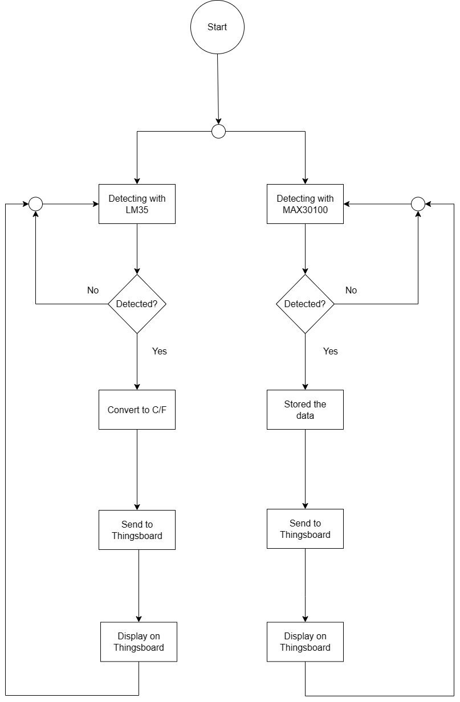
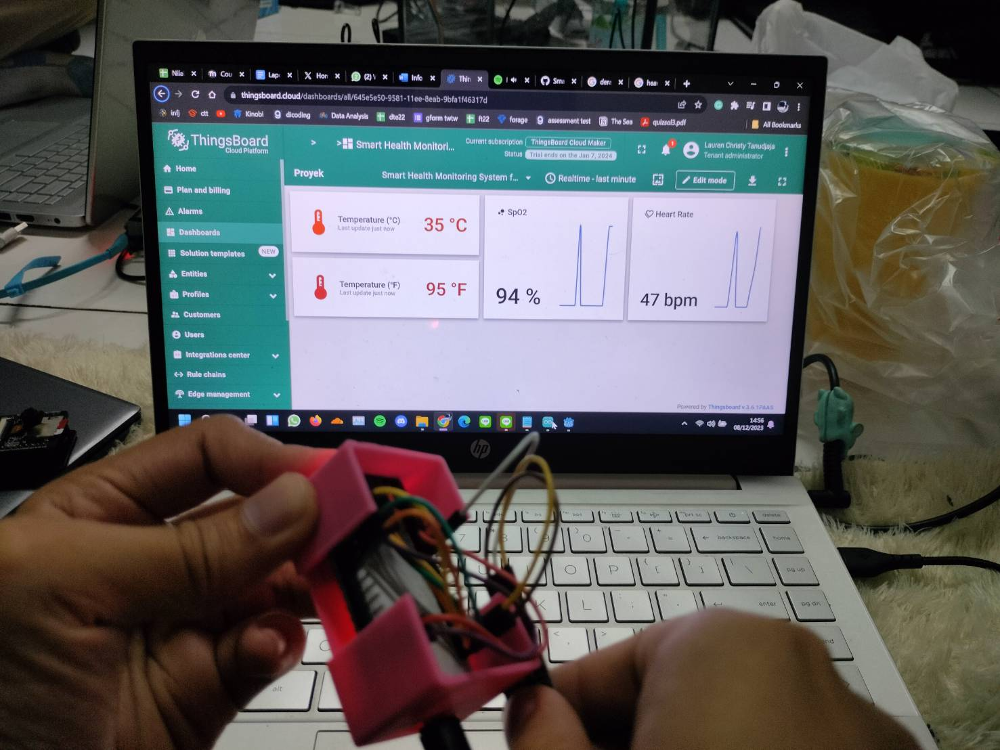

# Smart Health Monitoring System for Real-Time Heart Rate and Body Temperature Tracking

## Introduction to the problem and the solution

In the ever-evolving landscape of healthcare, there is a growing need for innovative and efficient solutions that empower individuals to monitor their health in real time. Recognizing this demand, we present the "Smart Health Monitoring System for Real-Time Heart Rate and Body Temperature Tracking," an IoT project aimed at seamlessly integrating technology into personal health management.

This innovative system, powered by the ESP32 microcontroller, MAX30100 pulse oximeter sensor, and LM35 temperature sensor, enables continuous real-time monitoring of heart rate and body temperature. By leveraging cutting-edge technology, our solution addresses the limitations of traditional healthcare monitoring, providing timely insights for proactive health management.

The MAX30100 sensor ensures accurate monitoring of heart rate and oxygen saturation levels, while the LM35 sensor captures precise body temperature data. Integrated with Thingsboard, a robust IoT platform, our system facilitates seamless data transmission and empowers users to visualize their health trends over time.

Accessible via smartphones through a dedicated application, our user-friendly interface allows real-time monitoring, personalized health goal setting, and alerts for abnormal readings. This portability ensures users can stay informed and proactive about their well-being anytime, anywhere.

## Hardware design and implementation details

The ESP32 is used as the central component, serving as the main brain of the system. The ESP32's capabilities in managing WiFi and Bluetooth connectivity are crucial for sending data to the cloud platform or mobile application to display information to users through an interactive user interface.

The MAX30100 is a versatile sensor specifically designed for heart rate measurement and blood oxygen saturation (SpO2) applications. This oximeter sensor operates on the I2C bus, connecting the I2C pins (SCL & SDA) from the oximeter module to GPIO 21 and GPIO 22 on the ESP32. Additionally, the INT pin is connected to GPIO 19 on the ESP32 as an analog input/output pin to transmit data.

The LM35 is an analog temperature sensor designed to measure the user's body temperature in degrees Celsius. The LM35 sensor has three pins: the VCC pin connected to Vin, the GND pin connected to ground, and the OUT pin connected to GPIO 36 or ADC0 for analog data transmission.

Readings from the MAX30100 sensor (heart rate) and LM35 sensor (body temperature) can be displayed in real-time through the Serial Monitor in the Arduino IDE and sent over the internet to a mobile application using the Thingsboard platform. This is intended to make it easy for users to access their readings through their smartphones.

## Network infrastructure

The code uses the WiFi library to connect to a WiFi network and the Arduino MQTT Client library to communicate with the ThingsBoard server over MQTT. The ESP32 connects to the WiFi network and the ThingsBoard server using the following credentials: WiFi SSID, WiFi password, ThingsBoard server address, and ThingsBoard access token. The ESP32 uses the PubSubClient library to connect to the ThingsBoard server and the ArduinoHttpClient library to send HTTP requests to the ThingsBoard server. 

## Software implementation details

Libraries and dependencies used:
- [ArduinoHttpClient](https://github.com/arduino-libraries/ArduinoHttpClient) `0.5.0` by Arduino
- [ArduinoJSON](https://arduinojson.org/?utm_source=meta&utm_medium=library.properties) `6.21.3` by Benoit Blanchon
- [MAX30100lib](https://github.com/oxullo/Arduino-MAX30100) `1.2.1` by OXullo Intersecans
- [PubSubClient](https://pubsubclient.knolleary.net/) `2.8.0` by Nick O'Leary
- [TBPubSubClient](https://pubsubclient.knolleary.net/) `Important! 2.9.2` by Nick O'Leary
- [ThingsBoardClientSDK](https://github.com/thingsboard/thingsboard-client-sdk) `0.12.0` by ThingsBoard

The source code is designed for ESP32 to read data from two sensors (MAX30100 pulse oximeter and LM35 temperature sensor) and send the data to the ThingsBoard platform over Wi-Fi. The code uses FreeRTOS tasks to handle different functionalities concurrently.

The code initializes the pulse oximeter and sets a callback function to be called when a heartbeat is detected. The setup() function creates four tasks: one for reading data from the MAX30100 sensor, one for reading data from the LM35 sensor, one for managing WiFi connections, and one for sending data to ThingsBoard, which each task is pinned to a specific core of the ESP32.
1. `WiFiTaskCode()`: continuously checks the WiFi connection status and attempts to reconnect if the connection is lost.
2. `ThingsBoardTaskCode()`: connects to the ThingsBoard server, reads the heart rate and SpO2 data from the pulse oximeter, reads the temperature data from the queue, and sends the data to ThingsBoard.
3. `MAX30100SensorReading()`: continuously reads data from the pulse oximeter and updates the heart rate and SpO2 variables.
4. `LM35SensorReading()`: continuously reads data from the LM35 temperature sensor, converts the ADC value to temperature, and sends the temperature data to the queue.

The program will acquire the oximeterMutex before accessing the pulse oximeter data and will release the mutex after the data has been accessed. This ensures that the pulse oximeter data is not accessed simultaneously by multiple tasks. Furthermore, the program will create a queue, each of which is a Temp struct. This queue allows the temperature data to be shared between the LM35 sensor reading task and the ThingsBoard task.

## Test results and performance evaluation

The Smart Health Monitoring System successfully captures data from both sensors and transmits it to Thingsboard in real-time for user monitoring. While the system delivers a seamless real-time display, occasional inconsistencies in sensor measurements may lead to perceived delays. This is caused by the use of more affordable and cheap sensors. Despite these challenges, the system demonstrates satisfactory performance in providing users with up-to-the-minute heart rate and body temperature information on the Thingsboard dashboard, with continuous attention to sensor quality essential for maintaining the system's reliability, and ensuring accurate health data representation.

## Conclusion and future work

The Smart Health Monitoring System seamlessly integrates the ESP32, MAX30100 sensor, and LM35 sensor for real-time heart rate and body temperature tracking. The ESP32 acts as the central hub, using WiFi and Bluetooth for data transmission. The versatile MAX30100 sensor measures heart rate and blood oxygen saturation, while the LM35 sensor accurately measures body temperature. Real-time readings are viewable through the Arduino IDE Serial Monitor and Thingsboard platform. We hope this project could inspire other similar projects and serves as a catalyst for creating impactful and comprehensive health monitoring solutions in the future.